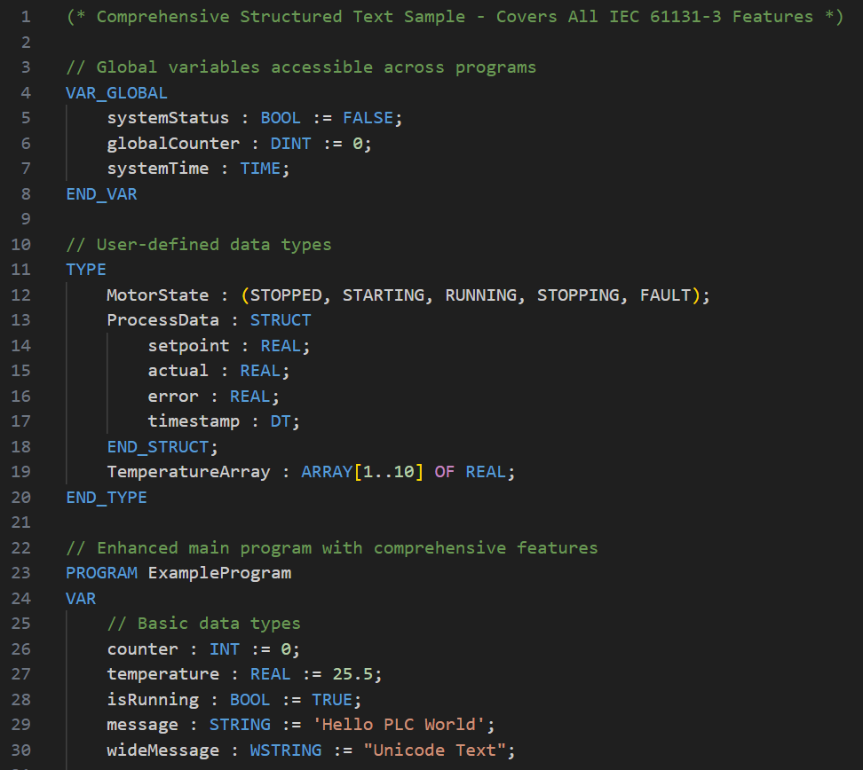

# ControlForge Structured Text

[](https://marketplace.visualstudio.com/items?itemName=ControlForgeSystems.controlforge-structured-text)
[](https://marketplace.visualstudio.com/items?itemName=ControlForgeSystems.controlforge-structured-text)

Professional **Structured Text (IEC 61131-3)** development environment for **PLC programming** in Visual Studio Code.

## Key Features

- **Real-time Diagnostics**: Errors and warnings as you type — Problems panel, red squiggly underlines, hover tooltips
- **Go to Definition & Find References**: Cross-file symbol navigation
- **Function Block IntelliSense**: Auto-complete for FB members (`myTimer.Q`, `upCounter.CV`)
- **Rich Syntax Highlighting**: Complete IEC 61131-3 language support
- **Smart Code Completion**: Context-aware suggestions for keywords, types, and variables
- **Workspace Indexing**: Automatic cross-file symbol discovery and resolution
- **Code Snippets**: Pre-built templates for common PLC patterns

## Screenshots

### Syntax Highlighting & IntelliSense

*Rich syntax highlighting for all IEC 61131-3 constructs*

## Getting Started

### Installation
1. Open **Visual Studio Code**
2. Go to **Extensions** (`Ctrl+Shift+X`)
3. Search for **"ControlForge Structured Text"**
4. Click **Install**

### Commands

Access via the Command Palette (`Ctrl+Shift+P`):

- **ControlForge Structured Text: Validate Syntax** - Check current file for syntax errors
- **ControlForge Structured Text: Check LSP Status** - Verify Language Server is running
- **ControlForge Structured Text: Show Index Statistics** - Display indexed workspace symbols

### Quick Start
1. Create a new file with `.st` or `.iecst` extension
2. Start typing - syntax highlighting activates automatically
3. Use `Ctrl+Space` for IntelliSense completion
4. Type function block instances followed by `.` for member completion

### Function Block Completion Example
```st
PROGRAM MyProgram
VAR
    startTimer : TON;          // Timer On-Delay
    partCounter : CTU;         // Counter Up
    emergencyStop : R_TRIG;    // Rising Edge Trigger
END_VAR

// IntelliSense in action:
startTimer.     // Shows: Q (BOOL), ET (TIME)
partCounter.    // Shows: Q (BOOL), CV (INT)
emergencyStop.  // Shows: Q (BOOL)
END_PROGRAM
```

## Language Features

### Smart IntelliSense
- **Function Block Members**: Auto-complete for all standard IEC 61131-3 function blocks
  - Timers: `TON`, `TOF`, `TP` → `Q`, `ET`
  - Counters: `CTU`, `CTD`, `CTUD` → `Q`, `CV`, `QU`, `QD`
  - Edge Detectors: `R_TRIG`, `F_TRIG` → `Q`
  - Bistables: `RS`, `SR` → `Q1`
- **Keyword Completion**: All IEC 61131-3 keywords and constructs
- **Data Type Suggestions**: `BOOL`, `INT`, `REAL`, `TIME`, `STRING`, etc.
- **Variable Detection**: Automatically detects declared variables
- **Code Snippets**: Templates for common patterns (IF-THEN, FOR loops, etc.)

### Navigation
- **Go to Definition**: Jump to symbol declarations across files
- **Find References**: Locate all usages of a symbol
- **Member Access Navigation**: Navigate from `instance.member` to FB definitions
- **Hover Information**: Type and documentation on hover

### Diagnostics
- **Real-time error detection**: Errors appear as you type with 300ms debounce
- **Unmatched blocks**: Missing `END_PROGRAM`, `END_IF`, `END_VAR`, etc.
- **Unclosed strings**: Single-quoted (`STRING`) and double-quoted (`WSTRING`)
- **Unmatched parentheses**: Per-line detection with string/comment awareness
- **Problems panel**: All diagnostics surface in `Ctrl+Shift+M` with source "ControlForge ST"
- **Case-insensitive**: Keyword matching per IEC 61131-3

### Syntax Highlighting
- **Keywords**: `IF`, `THEN`, `ELSE`, `FOR`, `WHILE`, `CASE`, `VAR`, `END_VAR`
- **Data Types**: `BOOL`, `INT`, `REAL`, `TIME`, `STRING`, `ARRAY`, `STRUCT`
- **Operators**: `AND`, `OR`, `NOT`, `XOR`, `:=`, `+`, `-`, `*`, `/`
- **Comments**: `//` single-line and `(* *)` multi-line
- **Literals**: String, numeric (decimal, hex, binary), time literals
- **Function Blocks**: Standard IEC 61131-3 function blocks

### Editor Features
- **Auto-closing**: Brackets, quotes, and parentheses
- **Comment Toggle**: `Ctrl+/` for quick commenting
- **Word Matching**: Intelligent word selection and highlighting
- **File Association**: Automatic recognition of `.st` and `.iecst` files

## Supported File Extensions
- `.st` - Standard Structured Text files
- `.iecst` - IEC 61131-3 Structured Text files

## Requirements
- **Visual Studio Code** 1.100.0 or higher
- **Operating System**: Windows, macOS, or Linux

## What's New (Unreleased)
- **Real-time diagnostics**: Unmatched blocks, unclosed strings, unmatched parentheses shown in Problems panel as you type
- **Multi-line declaration parsing**: Arrays, structs, and complex initializers now parse correctly
- **151 unit tests**: Comprehensive coverage for all LSP providers and diagnostics

## What's New in v1.2.5
- **Multi-line declaration parsing**: Arrays, structs, and complex initializers now parse correctly
- **VAR qualifier support**: `VAR_GLOBAL CONSTANT`, `VAR RETAIN`, etc.
- **Complex type support**: `STRING[n]`, `POINTER TO`, `REFERENCE TO`, multi-dim `ARRAY`
- **Case-insensitive symbol lookup**: IEC 61131-3 compliant across all symbol types
- **Memory leak fix**: Proper index cleanup on file close, debounced re-parsing
- **Performance**: 300ms debounce on document changes

## What's New in v1.2.0
- **Go to Definition & Find References**: Cross-file symbol navigation
- **Language Server Protocol (LSP)**: Full client-server architecture
- **Member Access Navigation**: Navigate from instance members to definitions
- **Workspace Indexing**: Automatic cross-file symbol discovery
- **IEC 61131-3 Definition Files**: Standard FB definitions for hover and completion

## Support & Feedback

- **Website**: [controlforge.dev](https://controlforge.dev/)
- **Issues**: [GitHub Issues](https://github.com/ControlForge-Systems/controlforge-structured-text/issues)
- **Discussions**: [GitHub Discussions](https://github.com/ControlForge-Systems/controlforge-structured-text/discussions)
- **Rate & Review**: [VS Code Marketplace](https://marketplace.visualstudio.com/items?itemName=ControlForgeSystems.controlforge-structured-text)
